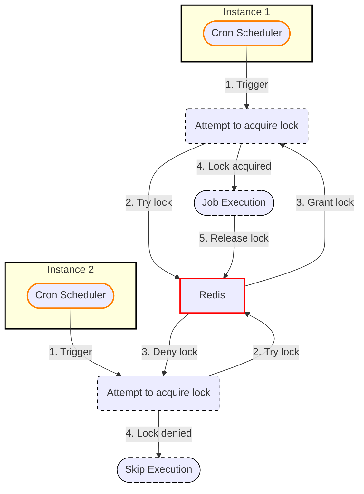

## Distributed Locking
> Distributed locking is a technique used to ***synchronize access to a shared resource*** across multiple processes running on different machines. It only allows one process to hold the lock at a time.

## Use Cases
I have a scenario where multiple instances of a service are running and I want to ensure that only one instance processes a job at a time. Here, the job is a shared resource and I want to synchronize access to it across multiple instances.

1. I am trying to simulate a real-world scenario where there's a job (sync.py) that is run as a cron every minute.
2. Running multiple docker containers (instances) simulates multiple instances of the service.
3. Redis is used as a distributed lock to synchronize access to the job across multiple instances.

## How to run
1. Setup Redis
```bash
# Install redis-server
brew install redis

# Start redis-server
redis-server --daemonize yes
```
2. Run the simulation
```bash
docker-compose up --build -d
```
3. Check the logs
```bash
docker-compose logs -f
```

A sample run of the simulation is shown below:
```bash
instance2  | 2024-07-20 20:47:00.769 | INFO     | __main__:<module>:56 - Instance 2: Script started at 2024-07-20 20:47:00
instance1  | 2024-07-20 20:47:00.769 | INFO     | __main__:<module>:56 - Instance 1: Script started at 2024-07-20 20:47:00
instance1  | 2024-07-20 20:47:00.796 | ERROR    | __main__:run_job:43 - Instance 1: Failed to acquire job lock, skipping this run
instance2  | 2024-07-20 20:47:00.796 | INFO     | __main__:run_job:19 - Instance 2: Acquired job lock
instance1  | 2024-07-20 20:47:00.796 | INFO     | __main__:<module>:60 - Instance 1: Script ended at 2024-07-20 20:47:00
instance2  | 2024-07-20 20:47:02.265 | INFO     | __main__:run_job:31 - Instance 2: Successfully called joke_api - Status: 200
instance2  | 2024-07-20 20:47:02.913 | INFO     | __main__:run_job:31 - Instance 2: Successfully called cat_fact_api - Status: 200
instance2  | 2024-07-20 20:47:03.387 | INFO     | __main__:run_job:31 - Instance 2: Successfully called ip_info_api - Status: 200
instance2  | 2024-07-20 20:47:03.951 | INFO     | __main__:run_job:31 - Instance 2: Successfully called random_user_api - Status: 200
instance2  | 2024-07-20 20:47:03.955 | INFO     | __main__:run_job:51 - Instance 2: Released job lock
instance2  | 2024-07-20 20:47:03.956 | INFO     | __main__:<module>:60 - Instance 2: Script ended at 2024-07-20 20:47:03
```
Here, Instance 1 failed to acquire the job lock and skipped the job execution. Instance 2 acquired the job lock and successfully executed the job.


## Explanation

```python
# Instance 1                   # Instance 2                     # Instance 3
# ---------------------------  # ---------------------------    # ---------------------------

# All instances create a lock object referring to the same key in Redis
job_lock = redis_client.lock("job_lock", timeout=300)

# Attempt to acquire lock
have_lock = job_lock.acquire(False)
# Succeeds: have_lock=True     # Fails: have_lock=False         # Fails: have_lock=False

if have_lock:
    # Run job                  # Skipped                        # Skipped
else:                            else:                            else:
    # Skipped                  # Log warning                    # Log warning

finally:
    if have_lock:              if have_lock:                    if have_lock:
        job_lock.release()        # Skipped                        # Skipped
```



## Under the hood
Redis provides a `SETNX` command that sets a key if it does not exist along with a timeout.
```bash
SETNX job_lock 1 EX 300
```
* The key `job_lock` is set to 1 if it does not exist.
* The `EX 300` argument sets the timeout for the key to 300 seconds. If the key is not released within 300 seconds, it is automatically released by Redis.

If you look at the implementation of `redis-py`, you will see that it uses the `SETNX` command to acquire the lock.
```python
def acquire(
        self,
        sleep: Optional[Number] = None,
        blocking: Optional[bool] = None,
        blocking_timeout: Optional[Number] = None,
        token: Optional[str] = None,
    ):
    ...
    while True:
            if self.do_acquire(token):

def do_acquire(self, token: str) -> bool:
        if self.timeout:
            # convert to milliseconds
            timeout = int(self.timeout * 1000)
        else:
            timeout = None
        if self.redis.set(self.name, token, nx=True, px=timeout):
            return True
        return False
```

To release the lock it calls a Lua script that checks if the token matches the token stored in the key and then deletes the key.
```python
def do_release(self, expected_token: str) -> None:
        if not bool(
            self.lua_release(keys=[self.name], args=[expected_token], client=self.redis)
        ):
```

corresponding Lua script:
```lua
local token = redis.call('GET', KEYS[1])
if not token or token ~= ARGV[1] then
    return 0
end
return redis.call('DEL', KEYS[1])
return 1
```


## Resources
* [How Distributed Lock works | ft Redis | System Design](https://www.youtube.com/watch?v=qY4MfWv01pI)
* [Distributed Locks with Redis](https://redis.io/docs/latest/develop/use/patterns/distributed-locks/)
* 🔥 [redis-py Implementation](https://github.com/redis/redis-py/blob/master/redis/lock.py)

## TODOs
### Granular Control
The sync script runs at one particular time & it triggers all the APIs/Scripts at the same time. This is not ideal. Example -

```bash
30 5 * * * /usr/bin/curl --request GET https://official-joke-api.appspot.com/random_joke
30 6 * * * /usr/bin/curl --request GET https://catfact.ninja/fact
30 7 * * * /usr/bin/curl --request GET https://ipapi.co/json/
```

Here, I want to run the 3 APIs at different times. I can't do this with the current setup. Currently, the sync script runs at a set time & executes all the APIs at the same time.

I need to change the cron job to run the sync script at different times & then the sync script should trigger the APIs at different times.

### State Maintenance